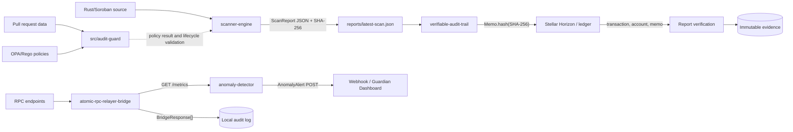
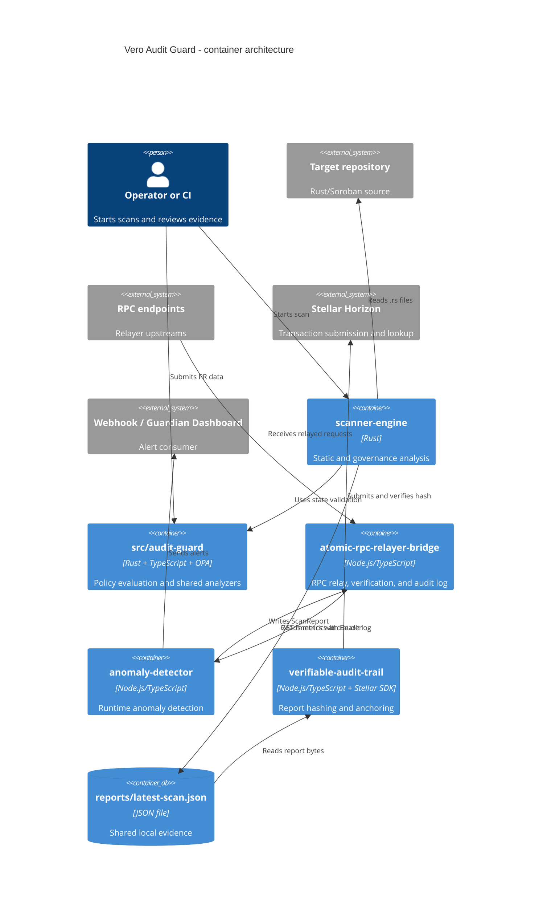

# Vero Audit Guard Architecture

## Purpose and scope

Vero Audit Guard is the security watchtower for the Vero Protocol. It combines static analysis of Rust/Soroban contracts, policy evaluation for pull requests, relayer observability, RPC integrity controls, and a verifiable audit trail anchored on Stellar.

This document is the root architectural view. It describes the five repository contexts, their boundaries, data contracts, operational flow, security invariants, and deployment topology. Implementation details remain in each subpackage and linked operational documentation.

The system has three planes:

- **Analysis and compliance:** `scanner-engine` and `src/audit-guard` inspect code and pull-request data.
- **Relayer observability:** `atomic-rpc-relayer-bridge` and `anomaly-detector` relay requests and observe runtime metrics.
- **Evidence:** `verifiable-audit-trail` hashes reports and can anchor them on Stellar.

The packages are not one runtime library. Docker Compose coordinates them as services; the report file, HTTP endpoints, and Horizon are the integration boundaries.

## Repository contexts

| Context | Package | Technology | Responsibility | Key invariant |
| --- | --- | --- | --- | --- |
| Static Analysis | `scanner-engine` | Rust, edition 2021 | Scans Rust source and governance/multisig patterns and emits `ScanReport` | Only `.rs` files outside test paths are scanned; a `CRITICAL` finding exits non-zero |
| Policy and Compliance | `src/audit-guard` | Rust + TypeScript + OPA/Rego | Evaluates PR data, runs analyzers, and validates protocol state transitions | OPA evaluation failure is fail-closed; state tracking has no on-chain halt authority |
| Relayer Integration | `atomic-rpc-relayer-bridge` | Node.js/TypeScript | Relays RPC requests with retry, failover, idempotency, verification, and an audit log | Atomic verification is enabled by default; non-replayable requests are sent once |
| Runtime Observability | `anomaly-detector` | Node.js/TypeScript | Polls relayer metrics, detects anomalies, and sends alerts | Observational-only; bounded ingestion cannot pause or block on-chain operations |
| Evidence and Anchoring | `verifiable-audit-trail` | Node.js/TypeScript + Stellar SDK | Hashes, verifies, and optionally anchors report files | SHA-256 and account/memo checks must pass; Horizon URLs must be HTTPS |

## End-to-end data flow

1. An operator or CI supplies a Rust/Soroban target to `scanner-engine`. The default target is `../vero-core-contracts`; Compose mounts the target at `/target`.
2. The scanner walks readable `.rs` files outside `test`, `tests`, and `__tests__`, applies static rules, and runs governance/multisig rules.
3. It builds a `ScanReport`, computes its SHA-256 report hash, validates the lifecycle transition with `ZkStateValidationHook`, prints JSON, and writes `reports/latest-scan.json`.
4. A critical static or governance finding makes the scanner exit with status 1. Read failures are warned and excluded from `total_files`.
5. `src/audit-guard` evaluates PR data against OPA/Rego policies and exposes TypeScript policy and security analyzers. If OPA evaluation fails, the result is `NON_COMPLIANT` rather than silently falling back.
6. `verifiable-audit-trail` reads JSON reports from the shared `reports` volume, hashes the exact file bytes, and runs in dry-run mode unless `AUDIT_KEYPAIR_SECRET` is configured.
7. When anchoring is enabled, the trail submits a Stellar payment transaction containing `Memo.hash(hash)` and returns the transaction hash. Later verification queries Horizon and compares the local report hash with the transaction memo.
8. Independently, the bridge relays RPC requests and records `BridgeResponse` values. Its local server exposes authenticated metrics and audit-log endpoints.
9. `anomaly-detector` polls `/metrics`, protects ingestion with a token bucket and bounded queue, detects nonce, transaction, address, threat-feed, and latency anomalies, and sends non-blocking webhook/dashboard alerts.

### Data-flow diagram



### Container diagram



## Component responsibilities and invariants

### `scanner-engine`

The Rust binary in `scanner-engine/src/main.rs` scans a target path, applies static regex rules, and delegates governance checks to `multisig_scanner`. Its `ScanReport` is serialized to stdout and persisted under `reports/latest-scan.json`. It sorts ordinary findings by file, line, and rule and reports readable files only. The lifecycle hook validates a pre-state root, report hash, and scan nullifier before the report is accepted.

`GovernanceFinding` contains `file`, `line`, `rule`, `severity`, `snippet`, and `description`. Critical ordinary or governance findings fail the process. This component does not publish to Stellar directly.

### `src/audit-guard`

This package contains the OPA/Rego policy engine plus TypeScript security analyzers, alert dispatchers, and shared telemetry/state helpers. `PolicyEngine` accepts `PRData` and returns `EvaluationResult`. OPA is the primary evaluator; an unavailable CLI has an existing no-OPA path, but an OPA execution failure produces a critical non-compliant result. The protocol state machine is telemetry and lifecycle validation, not an emergency control plane.

### `atomic-rpc-relayer-bridge`

`AtomicRpcRelayerBridge` orders configured endpoints by priority, relays replay-safe requests with retries and failover, and optionally verifies stable response projections across endpoints. `GET` requests, explicitly idempotent requests, and requests with an idempotency key are replayable. Every returned `BridgeResponse` is appended to the in-memory audit log.

The local HTTP server defaults to port `8545`. `/health` and `/healthz` are public health checks. `/metrics` and `/audit-log` fail closed with `401` unless the request has a valid configured Bearer token. `DISABLE_ATOMIC_VERIFICATION=true` is an explicit integrity tradeoff and is rejected if the value is not exactly `true` or `false`.

### `anomaly-detector`

The detector polls the bridge, tracks previous nonces in `nonce-db.json`, and evaluates `RelayerMetrics` against configured thresholds. It can also check RPC node health, use threat feeds, and dispatch alerts to a webhook or dashboard. Telemetry passes through a token-bucket limiter and bounded drop-oldest queue. Delivery errors are logged and do not grant the detector authority to halt, pause, or block on-chain activity.

### `verifiable-audit-trail`

The trail hashes report bytes, records integrity incidents, and provides CLI flows for anchoring and verification. `anchorHash` uses the configured secret key, validates the optional anchor account, builds a Stellar native-asset payment to the anchor account with `Memo.hash(hash)`, and submits through Horizon. `verifyReport` checks the transaction, successful status, source account, memo type, and hash; it also hashes the local report before and after the Horizon lookup to detect changes during verification.

## Contracts and interfaces

### Scanner report and CLI

The scanner accepts one optional positional target path and defaults to `../vero-core-contracts`. Its JSON contract is:

```text
ScanReport {
  target: string,
  total_files: number,
  findings: Finding[],
  governance_findings: GovernanceFinding[],
  report_hash: string
}

Finding {
  file: string,
  line: number,
  rule: string,
  severity: LOW | MEDIUM | HIGH | CRITICAL,
  snippet: string
}

GovernanceFinding {
  file: string,
  line: number,
  rule: string,
  severity: string,
  snippet: string,
  description: string
}
```

The persisted artifact is `reports/latest-scan.json`. The report hash is the SHA-256 of the serialized report before the final `report_hash` value is inserted; the trail separately hashes the exact persisted file bytes for anchoring and verification.

### Bridge HTTP API

| Method and path | Success response | Failure/security behavior |
| --- | --- | --- |
| `GET /health` or `GET /healthz` | `{ "status": "ok", "service": "atomic-rpc-relayer-bridge" }` | Public health check |
| `GET /metrics` | `RelayerMetricsPayload[]`: `address`, `nonce`, `failedTxCount`, `timestamp` | Requires `Authorization: Bearer <AUTH_TOKEN>`; otherwise `401` |
| `GET /audit-log` | `BridgeResponse[]` | Requires `Authorization: Bearer <AUTH_TOKEN>`; otherwise `401` |
| Any other route | None | `{ "error": "not found" }`, status `404` |

Internal relay types are `BridgeRequest` (`id`, `method`, `endpoint`, optional `payload`, `timestamp`, optional `idempotent`, optional `idempotencyKey`) and `BridgeResponse` (`requestId`, `success`, optional `data`, optional `error`, `endpointUsed`, `latencyMs`, `timestamp`, `verificationStatus`). `verificationStatus` is `verified`, `failed`, `unavailable`, or `skipped`.

### Monitoring and alert contracts

```text
RelayerMetrics {
  address: string,
  nonce: number,
  failedTxCount: number,
  timestamp: number
}

AnomalyAlert {
  type: NONCE_SPIKE | FAILED_TX_BURST | UNAUTHORIZED_ADDRESS |
        THREAT_FEED_MATCH | NONCE_REUSE | RELAYER_LATENCY_HIGH,
  severity: LOW | MEDIUM | HIGH | CRITICAL,
  address?: string,
  detail: string,
  timestamp: number
}
```

The dashboard POST assembled by the detector includes `source`, `type`, `severity`, `message`, `detail`, an ISO timestamp, and `metadata`. The canonical dispatcher in `src/audit-guard` accepts `AnomalyAlertInput` with `type`, `severity`, `message`, `detail`, optional metadata, and an optional ISO timestamp.

### Policy contract

`PRData` contains pull-request fields (`title`, `body`, `labels`, `base_branch`, `head_branch`, `number`, `author`), `files_modified`, `additions`, `deletions`, and optional dependency, relayer, signature, timestamp, and maintenance fields. `EvaluationResult` contains `status` (`COMPLIANT`, `NON_COMPLIANT`, or `WARNING`), violations, warnings, summary, counts, high-severity violations, and optional overflow, maintenance, anchor, and security-tip fields.

### Stellar and Horizon contract

| Operation | Contract |
| --- | --- |
| `hashFile(reportPath)` | Returns exactly 64 lowercase hexadecimal characters for the file's SHA-256 digest |
| `anchorHash(hash, label)` | Requires `AUDIT_KEYPAIR_SECRET`; submits a native payment to the anchor account with `Memo.hash(hash)` and returns a transaction hash |
| `verifyReport(options)` | Returns `VerificationSuccess` or `VerificationFailure`; validates transaction hash, successful status, source account, memo, and local hash |
| CLI `anchor` | `node dist/index.js anchor <reports-directory>` |
| CLI `verify` | `node dist/index.js verify <report-file> --tx <transaction-hash> [--account <G...>] [--allow-legacy-memo-text]` |

`HORIZON_URL` must be an absolute HTTPS URL without embedded credentials. `STELLAR_NETWORK` is `testnet` or `mainnet`. Canonical verification uses a 32-byte Base64 `MEMO_HASH`; legacy `vero:<22 hex characters>` text verification requires explicit opt-in.

## Deployment and configuration

Docker Compose runs `scanner-engine` and `verifiable-audit-trail` as one-shot jobs and keeps the bridge and detector running. The scanner and trail share `./reports`; the detector reaches the bridge at `http://atomic-rpc-relayer-bridge:8545/metrics` inside the Compose network. TypeScript images use Node 22; native manifests require Node 20 or newer. Rust crates use edition 2021 and no repository toolchain file fixes a compiler version.

Important configuration includes `SCAN_HOST_TARGET`, `BRIDGE_PORT`, `AUTH_TOKEN`, `RELAYER_ADDRESS`, `RELAYER_METRICS_URL`, `AUTHORIZED_ADDRESSES`, `NONCE_SPIKE_THRESHOLD`, `FAILED_TX_THRESHOLD`, `RPC_NODE_URLS`, `THREAT_FEED_URLS`, `AUDIT_KEYPAIR_SECRET`, `AUDIT_ANCHOR_ACCOUNT`, `STELLAR_NETWORK`, and `HORIZON_URL`. Defaults and service wiring are authoritative in `docker-compose.yml` and each package manifest.

## Failure handling and security

- Critical scanner findings fail the build and are printed with file, line, severity, and rule.
- OPA execution failure fails closed as `NON_COMPLIANT`.
- Missing bridge authentication fails closed for metrics and audit-log access.
- Atomic verification is required by default; disabling it is explicit and logged.
- RPC retries are restricted to replayable requests to avoid duplicating non-idempotent operations.
- Horizon requests require HTTPS and bounded timeouts.
- Verification rejects missing, malformed, mismatched, or legacy memos unless legacy support is explicitly enabled.
- Report bytes are hashed locally and checked again after remote lookup.
- Secrets are environment configuration and must never be committed or included in documentation examples.
- Anomaly detection and lifecycle telemetry are observational and have no on-chain halt authority.

## References

- [Repository README](README.md)
- [Policy as Code](POLICY_AS_CODE.md)
- [Contribution and Compose workflow](CONTRIBUTING.md)
- [Incident response](INCIDENT_RESPONSE.md)
- [Security policy](SECURITY.md)
- [Scanner manifest](scanner-engine/Cargo.toml)
- [Policy engine manifest](src/audit-guard/Cargo.toml)
- [Compose topology](docker-compose.yml)
- [Issue #243 SSOT](docs/context/issue-243-context.md)

## Architecture Decision Records

### ADR-243-001: Root architecture document

- **Context:** The architecture spans five subpackages, Compose, shared reports, HTTP, and Horizon.
- **Decision:** Maintain `ARCHITECTURE.md` at the repository root and link it from `README.md`; keep implementation details in their owning packages.
- **Consequences:** One entry point improves navigation and onboarding; links and contracts must be maintained with code changes.

### ADR-243-002: Separate analysis, observability, and evidence

- **Context:** Scanner, detector, bridge, and trail have different lifecycles and failure modes.
- **Decision:** Document them as separate contexts joined by a report volume, HTTP, and Horizon rather than as one runtime library.
- **Consequences:** Ownership and boundaries remain explicit; integration changes require reviewing the root architecture.

### ADR-243-003: Document contracts from existing types and endpoints

- **Context:** There is no global OpenAPI or shared contracts package.
- **Decision:** Derive contracts from Rust structs, TypeScript interfaces, CLI usage, and implemented HTTP routes; do not invent unspecified fields.
- **Consequences:** The document follows the implementation; contract versioning remains a future concern.

### ADR-243-004: Mermaid as versioned diagram notation

- **Context:** The root document needs readable flow and component diagrams without introducing a generation toolchain.
- **Decision:** Embed Mermaid `flowchart` and `C4Container` diagrams in Markdown.
- **Consequences:** Diagrams are reviewed as code; the renderer must support the Mermaid C4 syntax.

### ADR-243-005: Treat security properties as architectural invariants

- **Context:** Fail-closed policy evaluation, authentication, HTTPS, hashing, idempotency, and observational-only monitoring shape system safety.
- **Decision:** State these properties in the invariant and failure sections and repeat them beside affected contracts.
- **Consequences:** Security review can begin at the architecture level; security changes require documentation review.