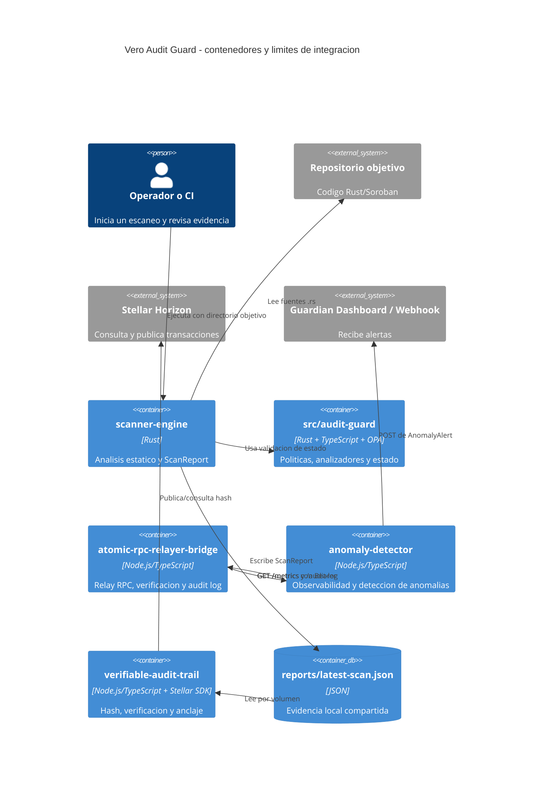

# Issue #243: Add Root Architecture Document

## Estado y alcance

- Repositorio: `Vero-protocol/vero-audit-guard`
- Rama de trabajo: `docs/issue-243-add-architecture-doc`
- Rama base: `main`
- Fase: especificacion para implementar `ARCHITECTURE.md` y actualizar `README.md`.
- Restriccion: documentacion y scaffolding solamente; no modificar codigo de negocio ni introducir dependencias.
- Fuente de verdad: este archivo conserva las decisiones y contratos identificados durante el issue.

## Objetivo arquitectonico

El documento raiz debe explicar como Vero Audit Guard convierte una entrada de codigo Rust/Soroban en un reporte verificable, como observa el estado del relayer y como conserva evidencia mediante un hash anclable en Stellar. Debe separar claramente el plano de analisis, el plano de observabilidad y el plano de evidencia.

## Sistema y limites de contexto

| Contexto | Subpaquete | Rol | Invariantes |
| --- | --- | --- | --- |
| Static Analysis | `scanner-engine` | Recorre fuentes Rust, aplica reglas regex y reglas de gobernanza, y genera el reporte firmado por hash | Solo procesa archivos `.rs`; excluye rutas de test; ordena findings; un finding `CRITICAL` hace fallar el proceso |
| Policy and Compliance | `src/audit-guard` | Expone el motor OPA/Rego, analizadores TypeScript y validacion de transiciones | La evaluacion OPA falla cerrado; el estado de ciclo no concede autoridad para detener operaciones on-chain |
| Relayer Integration | `atomic-rpc-relayer-bridge` | Relay RPC con failover, idempotencia, verificacion atomica y audit log local | Las solicitudes no replayables usan un solo endpoint; la verificacion atomica es obligatoria por defecto; `/metrics` y `/audit-log` requieren Bearer |
| Runtime Observability | `anomaly-detector` | Consume metricas del bridge, detecta anomalas y entrega alertas | Es estrictamente observacional: no pausa ni bloquea operaciones on-chain; la ingesta tiene limites de tasa y cola acotada |
| Evidence and Anchoring | `verifiable-audit-trail` | Calcula SHA-256, registra incidentes y verifica/ancla evidencia en Stellar mediante Horizon | El archivo se vuelve a leer/verificar; hashes son hex de 64 caracteres; Horizon debe usar HTTPS; red solo `testnet` o `mainnet` |

Los paquetes no forman una unica libreria runtime. `docker-compose.yml` los coordina como servicios, mientras que `scanner-engine` y `verifiable-audit-trail` intercambian evidencia por el volumen `reports` y `anomaly-detector` consulta al bridge por HTTP.

## Inventario tecnologico y entorno

- Node.js `>=20`, declarado en el manifiesto raiz y en `src/audit-guard/package.json`.
- Node.js 22 en las imagenes Docker de los servicios TypeScript.
- npm y `package-lock.json` por subpaquete Node.
- Rust/cargo para `scanner-engine` y `src/audit-guard`; ambos crates usan edicion 2021 y no fijan una version minima.
- OPA CLI para la ruta primaria de evaluacion de politicas de `src/audit-guard`.
- Docker Engine y Docker Compose v2 para el despliegue local multi-servicio.
- Stellar SDK y Horizon para la evidencia verificable.
- Auditor local: `scripts/audit-environment.sh`.

## Flujo de datos end-to-end

1. El operador o CI proporciona un directorio objetivo a `scanner-engine`; por defecto es `../vero-core-contracts` y en Compose se monta `/target`.
2. El scanner recorre fuentes Rust no pertenecientes a `test`, aplica reglas estaticas y analiza gobernanza/multisig.
3. Produce `ScanReport` con `target`, `total_files`, `findings`, `governance_findings` y `report_hash`. El hash es SHA-256 del JSON serializado antes de insertar el hash final.
4. El scanner valida la transicion de estado mediante `ZkStateValidationHook`, escribe `reports/latest-scan.json` y devuelve JSON por stdout. Un finding critico termina con codigo de error.
5. `verifiable-audit-trail` consume ese archivo desde el volumen compartido, calcula el SHA-256 de los bytes locales y puede ejecutar `anchorHash`/`auditAndAnchor` usando Stellar.
6. El anclaje usa una cuenta Stellar, una red (`testnet` o `mainnet`) y Horizon. La verificacion posterior compara el hash local con el memo de la transaccion y confirma cuenta, transaccion exitosa y protocolo de memo.
7. En paralelo, `atomic-rpc-relayer-bridge` relaya solicitudes RPC y registra cada `BridgeResponse` en su audit log.
8. `anomaly-detector` obtiene `RelayerMetrics[]` desde `/metrics`, aplica umbrales de nonce, transacciones fallidas, direccion no autorizada, feeds de amenaza y salud RPC, y emite `AnomalyAlert` hacia webhook/dashboard.

### Diagrama de flujo

```mermaid
flowchart LR
		Target[Codigo Rust/Soroban] --> Scanner[scanner-engine]
		Scanner -->|ScanReport JSON + SHA-256| Report[reports/latest-scan.json]
		Report --> Trail[verifiable-audit-trail]
		Trail -->|hash y memo| Horizon[Stellar Horizon]
		Horizon -->|tx hash / estado / memo| Verify[Verificacion de evidencia]
		Verify --> Immutable[(Anclaje verificable en Stellar)]

		RPC[Endpoints RPC] --> Bridge[atomic-rpc-relayer-bridge]
		Bridge -->|RelayerMetrics| Detector[anomaly-detector]
		Bridge -->|BridgeResponse[]| AuditLog[Audit log local]
		Detector --> Alerts[Webhook / Guardian Dashboard]
		Policies[OPA/Rego + analizadores] --> Guard[src/audit-guard]
		Guard -.->|politicas y estado de ciclo| Scanner
		Guard -.->|alertas/utilidades compartidas| Detector
```

### Diagrama C4 de contenedores



## Contratos identificados

### `scanner-engine` -> reporte

```text
ScanReport {
	target: string,
	total_files: number,
	findings: Finding[],
	governance_findings: GovernanceFinding[],
	report_hash: string
}

Finding {
	file: string,
	line: number,
	rule: string,
	severity: LOW | MEDIUM | HIGH | CRITICAL,
	snippet: string
}
```

El contrato de `GovernanceFinding` debe enlazarse a su definicion real en `scanner-engine/src/multisig_scanner.rs` al redactar `ARCHITECTURE.md`; no se debe duplicar una forma no confirmada en este SSOT. La salida de proceso es JSON por stdout y el archivo persistido es `reports/latest-scan.json`.

### `atomic-rpc-relayer-bridge` -> HTTP

| Metodo y ruta | Respuesta | Seguridad |
| --- | --- | --- |
| `GET /health` o `GET /healthz` | `{ status: "ok", service: "atomic-rpc-relayer-bridge" }` | Publica health check |
| `GET /metrics` | `RelayerMetricsPayload[]` con `address`, `nonce`, `failedTxCount`, `timestamp` | `Authorization: Bearer <AUTH_TOKEN>`; sin token devuelve `401` |
| `GET /audit-log` | `BridgeResponse[]` | `Authorization: Bearer <AUTH_TOKEN>`; sin token devuelve `401` |
| Otra ruta | `{ error: "not found" }` | `404` |

El contrato interno de relay es `BridgeRequest` (`id`, `method`, `endpoint`, `payload?`, `timestamp`, `idempotent?`, `idempotencyKey?`) -> `BridgeResponse` (`requestId`, `success`, `data?`, `error?`, `endpointUsed`, `latencyMs`, `timestamp`, `verificationStatus`). Los estados de verificacion son `verified`, `failed`, `unavailable` y `skipped`.

### `anomaly-detector` -> alertas

```text
RelayerMetrics {
	address: string,
	nonce: number,
	failedTxCount: number,
	timestamp: number
}

AnomalyAlert {
	type: NONCE_SPIKE | FAILED_TX_BURST | UNAUTHORIZED_ADDRESS |
				THREAT_FEED_MATCH | NONCE_REUSE | RELAYER_LATENCY_HIGH,
	severity: LOW | MEDIUM | HIGH | CRITICAL,
	address?: string,
	detail: string,
	timestamp: number
}
```

El detector persiste nonces en `nonce-db.json`, consulta `RELAYER_METRICS_URL`, aplica `NONCE_SPIKE_THRESHOLD`, `FAILED_TX_THRESHOLD` y `POLL_INTERVAL_MS`, y puede enviar un POST al dashboard con `source`, `type`, `severity`, `message`, `detail`, `timestamp` ISO y `metadata`.

### `src/audit-guard` -> politicas

La entrada de politica es `PRData`: pull request (`title`, `body`, `labels`, ramas, `number`, `author`), archivos modificados, cambios y dependencias opcionales, mas campos de relayer/firma/tiempo. La salida es `EvaluationResult` con `status` `COMPLIANT | NON_COMPLIANT | WARNING`, violaciones, warnings, resumen, contadores, hallazgos de overflow y metadatos opcionales de anclaje.

La evaluacion primaria es OPA/Rego desde `policies/`; si OPA falla durante la evaluacion, el resultado es `NON_COMPLIANT` (fail closed). La disponibilidad ausente de OPA puede usar la ruta sin OPA existente, pero `ARCHITECTURE.md` debe distinguir ese fallback de un fallo de evaluacion OPA.

### `verifiable-audit-trail` -> Stellar/Horizon

- `hashFile(reportPath) -> sha256Hex`: hash SHA-256 de bytes, exactamente 64 caracteres hexadecimales.
- `verifyReport(options) -> VerificationResult`: confirma archivo, transaccion, cuenta de anclaje, memo y hash.
- `anchorHash(hash, label) -> transactionHash`: publica evidencia; requiere documentar configuracion de cuenta secreta sin incluir secretos.
- `auditAndAnchor(reportDir)`: flujo CLI sobre el directorio de reportes.
- Horizon se consulta por transaccion; la URL configurada debe ser absoluta, HTTPS y sin credenciales embebidas.

## Secciones requeridas para `ARCHITECTURE.md`

1. **Proposito y alcance**: problema, actores, no-objetivos y terminologia.
2. **Mapa de repositorio**: los cinco contextos, sus manifiestos, entradas y salidas.
3. **Vista de contenedores**: diagrama C4, despliegue Compose y limites de proceso.
4. **Flujos operativos**: escaneo, politicas, observabilidad, failover y anclaje.
5. **Contratos de datos**: `ScanReport`, findings, `BridgeRequest/Response`, metricas, alertas, `PRData/EvaluationResult` y resultado de verificacion.
6. **Seguridad e invariantes**: fail-closed, Bearer, HTTPS, hashes, idempotencia, no autoridad de parada y secretos por entorno.
7. **Persistencia y evidencia**: volumen `reports`, `nonce-db.json`, audit log y transaccion Stellar.
8. **Configuracion y despliegue**: variables de entorno, puertos, dependencias Compose y requisitos locales.
9. **Fallos y recuperacion**: findings criticos, OPA, Horizon, endpoints RPC, health checks y alertas.
10. **Observabilidad y auditoria**: logs, metricas, alertas y trazabilidad desde reporte a transaccion.
11. **ADRs**: decisiones de este SSOT, consecuencias y revisiones futuras.
12. **Referencias**: README, CONTRIBUTING, SECURITY, POLICY_AS_CODE, incident response y manifiestos.

## Actualizaciones requeridas en `README.md`

Al crear `ARCHITECTURE.md`, actualizar el README raiz con:

- Un enlace visible desde la seccion de introduccion o estructura: `[Architecture](ARCHITECTURE.md)`.
- Una entrada `ARCHITECTURE.md` en el arbol de archivos junto a `CONTRIBUTING.md` y `POLICY_AS_CODE.md`.
- En "Getting Started", una referencia a la arquitectura antes de describir el flujo Docker Compose.
- En la tabla de servicios, enlaces a las secciones correspondientes de `ARCHITECTURE.md` cuando existan anclas estables.
- Una nota de fuente de verdad: contratos y limites se mantienen en `ARCHITECTURE.md`; este SSOT se conserva para el trabajo del Issue #243.

No modificar el README en esta fase si el entregable se limita al SSOT; los cambios anteriores son el checklist de la siguiente fase documental.

## ADRs del diseño documental

### ADR-243-001: Un documento raiz para la arquitectura global

- **Contexto:** La arquitectura esta distribuida entre cinco subpaquetes, Docker Compose y documentacion operativa.
- **Decision:** Crear `ARCHITECTURE.md` en la raiz como vista global y enlazar desde `README.md`; conservar detalles de implementacion en los subpaquetes.
- **Consecuencias:** Mejora la navegacion y la incorporacion de colaboradores; requiere mantener enlaces y contratos sincronizados.

### ADR-243-002: Separar analisis, observabilidad y evidencia

- **Contexto:** El scanner, el detector y el trail tienen ciclos de vida y fallos diferentes.
- **Decision:** Documentarlos como contextos separados, integrados por JSON/volumen, HTTP y Horizon, sin afirmar que forman una sola libreria runtime.
- **Consecuencias:** Los limites y responsabilidades son verificables; los cambios de contrato requieren actualizar la vista global y el SSOT.

### ADR-243-003: Contratos documentados desde tipos y endpoints existentes

- **Contexto:** No existe un esquema OpenAPI global ni un contrato versionado comun.
- **Decision:** Extraer los contratos actuales de interfaces TypeScript, structs Rust y rutas HTTP; marcar como pendiente cualquier forma no confirmada.
- **Consecuencias:** Se evita inventar dependencias o APIs, pero `ARCHITECTURE.md` debe incluir referencias a los simbolos fuente.

### ADR-243-004: Mermaid como notacion versionada

- **Contexto:** El documento debe mostrar flujo end-to-end y componentes sin añadir herramientas de generacion.
- **Decision:** Usar bloques Mermaid `flowchart` y `C4Container` embebidos en Markdown.
- **Consecuencias:** Los diagramas se revisan junto con el texto; el renderizador del repositorio debe soportar C4 Mermaid.

### ADR-243-005: Seguridad como invariante arquitectonica

- **Contexto:** Fail-closed de OPA, verificacion atomica, Bearer, HTTPS y hash son propiedades de control, no simples detalles de despliegue.
- **Decision:** Mantenerlas en una seccion de invariantes y repetirlas en cada contrato afectado.
- **Consecuencias:** Los lectores pueden evaluar riesgos desde la arquitectura; cambios de seguridad obligan a revisar ADRs y contratos.

## Pendientes y limites de esta especificacion

- Confirmar la forma completa de `GovernanceFinding` desde `scanner-engine/src/multisig_scanner.rs` al redactar el documento raiz.
- Confirmar el formato exacto del memo producido por `anchorHash` y sus limites de longitud en la seccion de Stellar.
- Definir versionado formal de `ScanReport`, metricas y alertas; actualmente son interfaces locales, no un paquete de contratos compartidos.
- No existe `rust-toolchain.toml`; la auditoria valida herramientas disponibles, no una version inventada.
- Las versiones exactas de dependencias permanecen gobernadas por manifiestos y lockfiles existentes.

## Commit de la fase

```bash
git add docs/context/issue-243-context.md && git commit -m "docs(arch): definir ADRs y contratos para issue-243"
```